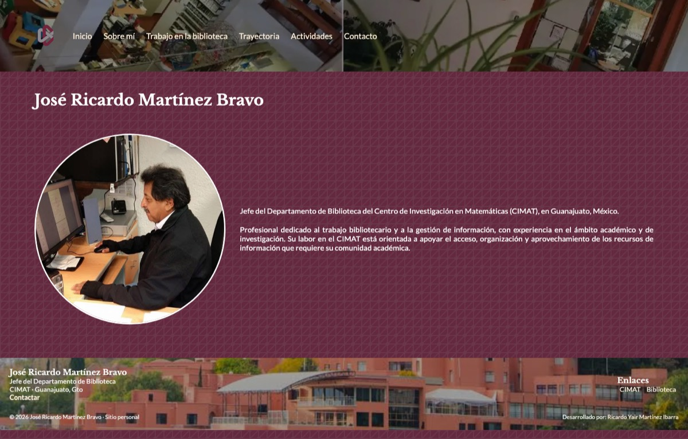
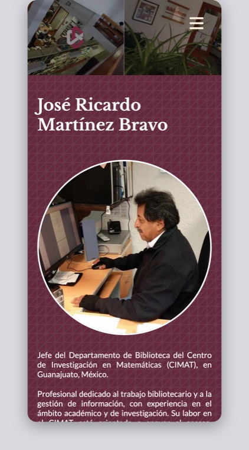

# Sitio Web Personal — José Ricardo Martínez Bravo

Sitio web personal e institucional de **José Ricardo Martínez Bravo**, Jefe del Departamento de Biblioteca del [CIMAT](https://www.cimat.mx) (Centro de Investigación en Matemáticas, A.C.) en Guanajuato, México.

El sitio presenta su trayectoria profesional y su labor en el ámbito bibliotecario y de gestión de información dentro de una comunidad académica de investigación.

> Este proyecto es también un ejercicio práctico de Git/GitHub y una pieza de portafolio de quien lo desarrolla. Todas las mejoras que se hagan aquí forman parte de un proceso de aprendizaje continuo.


---

## 🖼️ Vista previa

<p align="center">
  
  &nbsp;&nbsp;
  
</p>

<p align="center"><sub>Vista de escritorio (1440 px) y vista móvil (390 px) de la página de inicio.</sub></p>

---

## 📌 Sobre el proyecto

Un sitio **100% estático** (sin frameworks, sin build, sin dependencias que instalar) construido a mano con HTML5, CSS3 y JavaScript vanilla. El objetivo es doble:

1. **Para el usuario del sitio:** tener presencia web profesional, accesible y ligera, que documente su trabajo como jefe de biblioteca en una institución de investigación matemática.
2. **Para el desarrollador:** practicar un flujo de trabajo real con Git (ramas, commits, historial) y tener un repositorio público que demuestre habilidades de desarrollo web.

### 👨‍💻 Desarrollado por

**Ricardo Yair Martínez Ibarra**

- **GitHub:** [@rymi14](https://github.com/rymi14)
- **Correo:** [ryair.martinezi@gmail.com](mailto:ryair.martinezi@gmail.com)

---

## ✨ Funcionalidades

- **Diseño responsive** — se adapta a escritorio, tablet y móvil mediante `@media queries`.
- **Menú de navegación** — menú horizontal en escritorio y menú lateral deslizable (*off-canvas*) en móvil.
- **Página de inicio** con fotografía de perfil, presentación y puesto actual.
- **Estructura multipágina** preparada: Inicio, Sobre mí, Trabajo en la biblioteca, Trayectoria, Actividades y Contacto.
- **Pie de página reutilizable** con información de contacto y enlaces institutionales.
- **Accesibilidad y semántica** — HTML semántico (`header`, `nav`, `main`, `footer`), atributos `alt`, `rel="noopener noreferrer"` en enlaces externos.
- **Diseño de bajo peso** — carga rápida, sin dependencias heavy ni paso de compilación.
- **Tipografía y recursos externos** servidos por CDN (Google Fonts, Font Awesome).

---

## 🛠️ Tecnologías

| Tecnología | Uso |
|---|---|
| **HTML5** | Estructura y contenido de las páginas |
| **CSS3** | Estilos, paleta de colores, flexbox y diseño responsive |
| **JavaScript (vanilla)** | Menú de navegación interactivo |
| **Font Awesome** | Iconografía (vía CDN) |
| **Google Fonts** | Tipografías *Libre Baskerville* y *Lato* (vía CDN) |
| **Git / GitHub** | Control de versiones y publicación |

---

## 📁 Estructura del proyecto

```
SitioWebRicMtz/
├── index.html          # Página de inicio
├── sobre-mi.html       # Biografía y semblanza
├── biblioteca.html     # Trabajo en la biblioteca
├── experiencia.html    # Trayectoria profesional
├── proyectos.html      # Actividades y proyectos
├── contacto.html       # Información de contacto
├── styles.css          # Hoja de estilos global
├── main.js             # Lógica del menú móvil
├── .gitignore          # Exclusiones de Git
└── img/                # Recursos gráficos (logotipo, fotografía, fondos, imágenes de la vista previa)
```

> ℹ️ Las páginas `biblioteca.html`, `experiencia.html`, `proyectos.html` y `contacto.html` aún no se han integrado a este repositorio, por lo que los enlaces del menú de navegación no están disponibles todavía.

---

## 🚀 Puesta en marcha

El sitio es estático, así que basta con abrirlo en el navegador:

```bash
# Opción 1: abrir directamente
open index.html

# Opción 2: servirlo localmente (recomendado, evita restricciones del navegador)
python3 -m http.server 8000
```

Y abrir <http://localhost:8000> en el navegador.

### Clonar el repositorio

```bash
git clone https://github.com/rymi14/SitioWebRicMtz.git
cd SitioWebRicMtz
```

<details>
<summary>🖼️ Cómo se generaron las vistas previas</summary>

Las imágenes de la vista previa no se toman a mano: se generan con **Chrome en modo headless** para que siempre estén al día con el estado real del sitio.

```bash
# 1. Levantar el sitio en un servidor local
python3 -m http.server 8000

# 2. Captura de escritorio (1440 x 920 px)
"/Applications/Google Chrome.app/Contents/MacOS/Google Chrome" \
    --headless=new --disable-gpu --hide-scrollbars \
    --window-size=1440,920 \
    --screenshot=img/desktop.png \
    http://127.0.0.1:8000/index.html

# 3. Redimensionar, convertir a JPEG y comprimir
sips -Z 1200 -s format jpeg -s formatOptions 72 \
    img/desktop.png --out img/desktop.jpg

rm img/desktop.png
```

La vista móvil se obtiene renderizando el sitio dentro de un `iframe` de **390 px** de ancho (el ancho real de un teléfono), montado en una página auxiliar con un marco y sombra para que la captura se vea como un dispositivo.

</details>

---

## 📊 Estado de desarrollo

| Página | Estado |
|---|---|
| `index.html` — Inicio | ✅ Completa |
| `sobre-mi.html` — Sobre mí | ✅ Completa |
| `biblioteca.html` — Biblioteca | ✅ Completa |
| `experiencia.html` — Experiencia | ✅ Completa |
| `proyectos.html` — Actividades | ✅ Completa |
| `contacto.html` — Contacto | ✅ Completa  |
| Responsive / menú móvil | ✅ Implementado |

---

## 📝 Notas técnicas

Decisiones que se tomaron durante el desarrollo y los conceptos que este proyecto está sirviendo para practicar:

- **Sin framework:** HTML, CSS y JS puros para entender la base del desarrollo web sin abstracciones intermedias.
- **Diseño desktop-first:** las reglas base de la hoja de estilos están escritas para escritorio, y el breakpoint `@media (max-width: 750px)` reorganiza la interfaz para móvil: el navbar horizontal se convierte en un menú deslizable con `transform` + `transition`.
- **Ajustes finos en móvil:** dentro del breakpoint se reducen el `padding` del navbar (50px → 10px) y el tamaño del logotipo (50px → 42px) para recuperar espacio en pantallas angostas.
- **CSS organizado por bloques** con comentarios de sección: formatos generales, navegación, contenido y pie de página.
- **Rutas relativas** entre páginas, lo que permite publicar el sitio en cualquier subcarpeta (por ejemplo, en GitHub Pages) sin romper enlaces.
- **Paleta y recursos:** color guinda institucional del CIMAT, tipografía serif para títulos y sans para cuerpo de texto.

---

## 🙏 Créditos

- **CIMAT** — Centro de Investigación en Matemáticas, A.C. ([cimat.mx](https://www.cimat.mx)) por el logotipo y las imágenes de fondo utilizadas. El logotipo es una marca registrada de la institución y se usa únicamente con fines de identificación institucional.
- **Font Awesome** — Iconos ([fontawesome.com](https://fontawesome.com))
- **Lato** y **Libre Baskerville** — Tipografías de [Google Fonts](https://fonts.google.com)

---

© 2026 José Ricardo Martínez Bravo · Sitio personal
Desarrollado por [Ricardo Yair Martínez Ibarra](https://github.com/rymi14) · [ryair.martinezi@gmail.com](mailto:ryair.martinezi@gmail.com)
